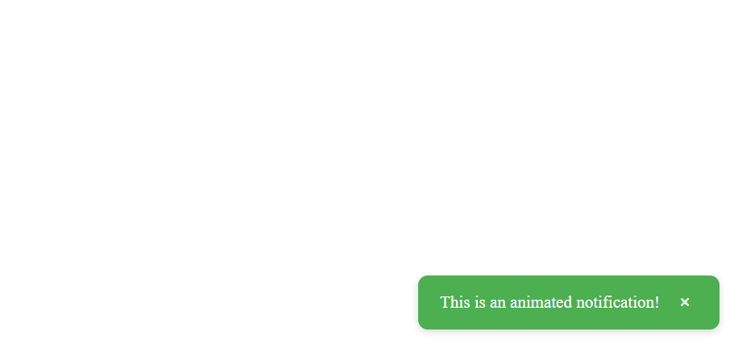

# @makozi/react-notify-stack

Animated notification system with stacked toasts and custom positions for React and Next.js.

---

## Features

Animated notification system with stacked toasts and custom positions for React and Next.js.

---

## Table of Contents
- [Features](#features)
- [Installation](#installation)
- [Usage](#usage)
- [API Reference](#api-reference)
- [Options](#options)
- [Styling](#styling)
- [Contributing](#contributing)
- [License](#license)

---

## Features

- Stacked toasts with **slide + fade animations**
- **Custom positions**: top-right, top-left, bottom-right, bottom-left
- **Dismiss button** or auto-remove
- Types: success, error, info, warning
- Lightweight and compatible with React + Next.js
- Easy integration with context and hooks

---

## Installation

```bash
npm install @makozi/react-notify-stack react-transition-group
```

---

## Usage

Wrap your app with `NotifyProvider` and include `ToastContainer`:

```tsx
import React from 'react';
import { NotifyProvider, ToastContainer, useNotify } from '@makozi/react-notify-stack';

const App = () => (
  <NotifyProvider>
    <ToastContainer />
    <Home />
  </NotifyProvider>
);

const Home = () => {
  const { notify } = useNotify();

  return (
    <button
      onClick={() =>
        notify('This is an animated notification!', {
          type: 'success',
          position: 'bottom-left'
        })
      }
    >
      Show Notification
    </button>
  );
};

export default App;
```

---

## API Reference

### `NotifyProvider`
Wraps your application and provides notification context.

### `ToastContainer`
Renders the stack of toasts. Place it inside `NotifyProvider`.

### `useNotify()`
Custom hook to trigger notifications.

#### `notify(message, options)`
- `message` (`string`): Toast text
- `options` (`object`): See [Options](#options)

---

## Options

| Option    | Type     | Description                                                      | Default      |
|-----------|----------|------------------------------------------------------------------|--------------|
| message   | string   | Toast text                                                       | —            |
| type      | string   | success, error, info, warning                                    | info         |
| position  | string   | top-right, top-left, bottom-right, bottom-left                   | top-right    |
| duration  | number   | Time in ms before auto-dismiss                                   | 4000         |

---

## Styling

The package includes default CSS animations in `toast-animations.css`. You can override styles as needed.

```js
import '@makozi/react-notify-stack/dist/toast-animations.css';
```

---

## Contributing

Contributions are welcome! Please open issues or submit PRs for improvements or bug fixes.

---


---

## Visualization

Below are visual examples of the toast notifications:

### Bottom Right Toast


### Bottom Left Toast


---

## License

MIT © Makozi Marizu-Ibewiro


---

## Repository

[https://github.com/makozi/react-notify-stack](https://github.com/makozi/react-notify-stack)

## Homepage

[https://github.com/makozi/react-notify-stack](https://github.com/makozi/react-notify-stack)


